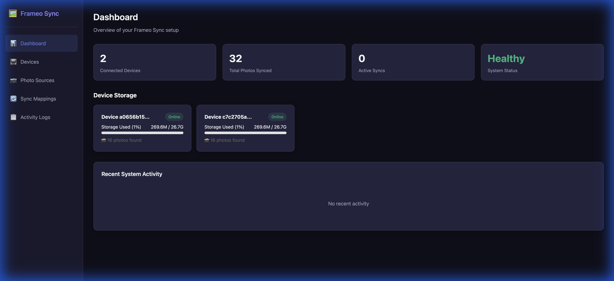
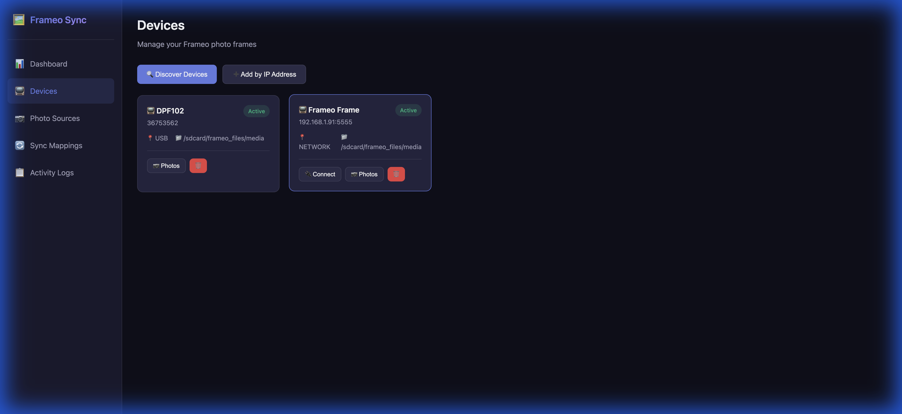
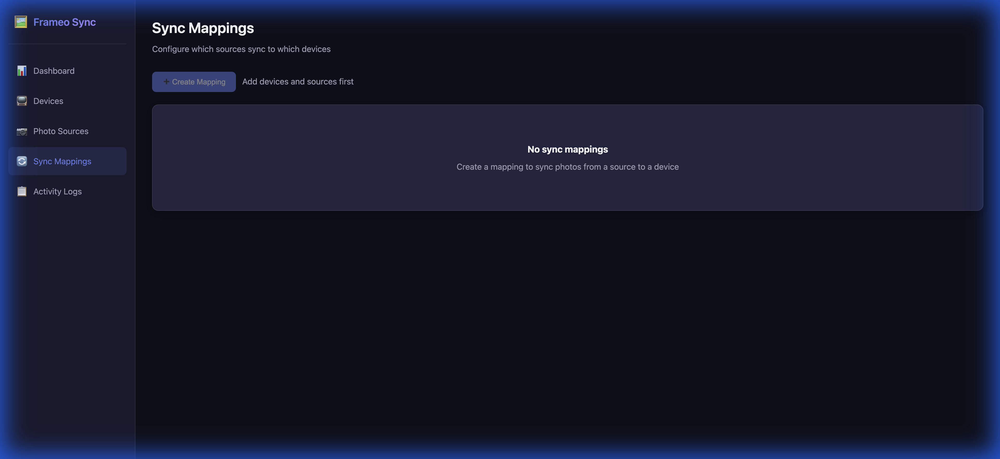

# Frameo Sync

> **Sync photos from various sources to your Frameo digital photo frames** — without using the Frameo cloud service.


## ✨ Features

- 📷 **Multiple Photo Sources**: Google Photos, local folders
- 📺 **Multi-Device Support**: Sync different albums to different frames
- 🔄 **Automatic Sync**: Schedule syncs hourly, daily, or weekly
- 🖼️ **Image Processing**: Auto-resize, format conversion, HEIC support
- 📱 **Web Dashboard**: Modern React UI for easy management
- 🔒 **Security**: Rate limiting, input validation, secure headers

## 📸 Screenshots

| Dashboard | Devices | Sync Mappings |
|-----------|---------|---------------|
|  |  |  |

---

## 🚀 Quick Start (5 minutes)

### Prerequisites

1. **Node.js 20+** installed ([download](https://nodejs.org/))
2. **Frameo digital photo frame** with ADB enabled:
   - On your frame: Settings → About → Beta Program → **Enable ADB Access**
   - Note your frame's IP address: Settings → About → IP Address

### Step 1: Clone and Install

```bash
git clone https://github.com/yourusername/frameo-sync.git
cd frameo-sync
npm install
```

### Step 2: Start the Server

```bash
npm run dev
```

The server starts at **http://localhost:3000**

### Step 3: Open the Dashboard

Open http://localhost:3000 in your browser. You'll see:

| Tab | Purpose |
|-----|---------|
| **Dashboard** | Overview of devices, photos, and recent activity |
| **Devices** | Add and manage Frameo frames |
| **Photo Sources** | Configure local folders or Google Photos |
| **Sync Mappings** | Create source → device sync rules |
| **Activity Logs** | View sync history and errors |

### Step 4: Add Your Frameo Frame

1. Click **Devices** → **Add by IP Address**
2. Enter your frame's IP address (e.g., `192.168.1.100`)
3. Click **Add Device**

### Step 5: Add a Photo Source

1. Click **Photo Sources** → **Add Source**
2. Choose "Local Folder" and enter a path (e.g., `/Users/you/Photos/Family`)
3. Click **Add Source**

### Step 6: Create a Sync Mapping

1. Click **Sync Mappings** → **Create Mapping**
2. Select your source and device
3. Choose a sync mode:
   - **Add Only**: Only add new photos (safe)
   - **Mirror**: Keep device in sync with source (removes deleted photos)
4. Optionally set an automatic schedule
5. Click **Create Mapping**

### Step 7: Sync!

Click **Sync Now** on your mapping. Photos will be pushed to your frame!

---

## 🐳 Docker Deployment

For production deployment, use Docker:

```bash
# Build and start
docker compose up --build -d

# View logs
docker logs frameo-sync

# Stop
docker compose down
```

### Docker Compose with Persistent Storage

```yaml
# docker-compose.yml
services:
  frameo-sync:
    build: .
    ports:
      - "3000:3000"
    volumes:
      - ./data:/app/data          # Database persistence
      - /path/to/photos:/photos   # Local photo folder access
    environment:
      - PHOTOS_PATH=/photos
      - DATABASE_PATH=/app/data/frameo.db
    restart: unless-stopped
```

---

## ⚙️ Configuration

Create a `.env` file in the project root:

```bash
# Server
PORT=3000
LOG_LEVEL=info  # error, warn, info, debug

# Storage
DATABASE_PATH=./data/frameo.db
PHOTOS_PATH=./photos

# ADB (default connects to local ADB server)
ADB_HOST=localhost
ADB_PORT=5037

# Google Photos (optional)
GOOGLE_CLIENT_ID=your-client-id
GOOGLE_CLIENT_SECRET=your-client-secret
GOOGLE_REDIRECT_URI=http://localhost:3000/api/oauth/google/callback
```

---

## 📡 API Reference

### Health Check
```bash
curl http://localhost:3000/api/health
# {"status":"ok","version":"1.0.0"}
```

### Devices
| Method | Endpoint | Description |
|--------|----------|-------------|
| GET | `/api/devices` | List all registered devices |
| GET | `/api/devices/discover` | Discover connected ADB devices |
| POST | `/api/devices` | Register a new device |
| GET | `/api/devices/:id/photos` | List photos on device |
| POST | `/api/devices/:id/photos` | Upload a photo |
| DELETE | `/api/devices/:id/photos` | Delete photos |

### Sources
| Method | Endpoint | Description |
|--------|----------|-------------|
| GET | `/api/sources` | List all sources |
| POST | `/api/sources` | Create a source |
| DELETE | `/api/sources/:id` | Delete a source |

### Sync
| Method | Endpoint | Description |
|--------|----------|-------------|
| GET | `/api/sync/mappings` | List all mappings |
| POST | `/api/sync/mappings` | Create a mapping |
| PUT | `/api/sync/mappings/:id` | Update a mapping |
| DELETE | `/api/sync/mappings/:id` | Delete a mapping |
| POST | `/api/sync/mappings/:id/sync` | Trigger sync now |
| GET | `/api/sync/logs` | View sync logs |

---

## 🧪 Development

### Running Tests

```bash
# Run all tests
npm run test

# Watch mode
npm run test:watch

# Type checking
npm run typecheck
```

### Project Structure

```
frameo-sync/
├── src/
│   ├── api/           # Express API routes
│   ├── config/        # Environment configuration
│   ├── database/      # SQLite database + schema
│   ├── middleware/    # Validation, error handling
│   ├── services/      # Core business logic
│   │   ├── adb/       # ADB device communication
│   │   ├── sources/   # Photo source implementations
│   │   └── sync/      # Sync engine + scheduler
│   ├── utils/         # Logging, errors
│   └── __tests__/     # Unit tests
├── web/               # React frontend
├── docker-compose.yml
└── README.md
```

### Building for Production

```bash
# Build TypeScript
npm run build

# Build frontend
cd web && npm run build

# Start production server
npm start
```

---

## 🔐 Security

This application implements security best practices:

- **Helmet.js**: Security headers (HSTS, X-Frame-Options, etc.)
- **Rate Limiting**: 1000 requests per 15 minutes per IP
- **Input Validation**: Zod schemas validate all API inputs
- **Path Traversal Protection**: Sanitized filenames on all file endpoints
- **Request Tracing**: Unique X-Request-ID for debugging

---

## 🔧 Troubleshooting

### "Device not found" error

1. Ensure ADB is enabled on your Frameo frame
2. Check your frame's IP address hasn't changed
3. Try the **Connect** button on the Devices page

### Photos not appearing on frame

1. Check the sync logs for errors
2. Ensure the source folder contains supported formats (JPG, PNG, WebP)
3. Try a manual sync with **Sync Now**

### "Connection refused" when starting

Another process may be using port 3000. Either:
- Stop the other process, or
- Change the port: `PORT=3001 npm run dev`

---

## 📝 Setting Up Google Photos

1. Go to [Google Cloud Console](https://console.cloud.google.com)
2. Create a new project
3. Enable the **Photos Library API**
4. Create **OAuth 2.0 credentials** (Web application)
5. Add redirect URI: `http://localhost:3000/api/oauth/google/callback`
6. Copy Client ID and Secret to your `.env` file
7. In the app, create a Google Photos source and click **Auth**

---

## 📄 License

MIT License - feel free to use this project for personal or commercial purposes.

---

## 🤝 Contributing

Contributions welcome! Please:

1. Fork the repository
2. Create a feature branch
3. Add tests for new functionality
4. Submit a pull request

---

Made with ❤️ for digital photo frame enthusiasts
